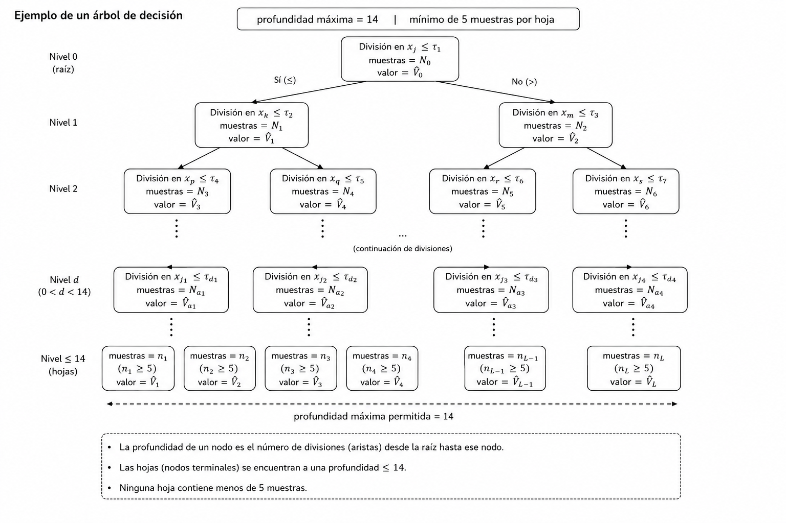

# Modelo Matemático para Optimizar la Operación de un Sistema Hidroeléctrico.

::: {style="text-align: justify"}
El objetivo de este capítulo es presentar una formulación rigurosa del problema de optimización de la operación de un sistema hidroeléctrico como un Proceso de Decisión de Markov (MDP), junto con una descripción detallada del algoritmo de Fitted Q-Iteration (FQI) utilizado para aproximar la política óptima. Se enfatizará la conexión entre los elementos matemáticos formales y su implementación numérica, así como la validación operativa mediante simulación en lazo cerrado.
:::

## Formulación como Proceso de Decisión de Markov (MDP)

Siguiendo la notación de @puterman1994markov, se define el MDP como la colección de objetos $$\{(T, \mathcal{S}, \mathcal{A}, \mathbb{P}, \mathcal{R})\},$$ donde cada componente se especifica a continuación:

### Estructura Temporal $(T)$
::: {style="text-align: justify"}
Se considera un horizonte temporal de operación compuesto por $T = 50$ años históricos, en donde cada uno de ellos se dividieron en $q = 24$ quincenas. Con el fin de reducir la dimensionalidad temporal y poder capturar la estacionalidad, se agruparon las quincenas en $M = 6$ etapas hidrológicas (segmentación temporal del año) mediante la siguiente función de agregación $\mu: \{0,\dots,q-1\} \to \{0,\dots,M-1\}$ definida por $$\mu(q) = \begin{cases} 0, & 0 \leq q <10\\ 1, & 10 \leq q <14\\ 2, & 14 \leq q < 16\\ 3, & 16 \leq q < 18\\ 4, & 18 \leq q < 20\\ 5, & 20 \leq q \leq 23\\ \end{cases}$$ {#eq-etapas}
así, la variable $m = \mu(q)$ representará la etapa hidrológica correspondiente a la quincena $q$.
:::

### Espacio de estados y operador de discretización $(\mathcal{S})$
::: {style="text-align: justify"}
El sistema está compuesto por dos presas: [La Angostura](https://maps.app.goo.gl/NHNQdHdfYAoRGxhPA) $(i = 1)$ y [Malpaso](https://maps.app.goo.gl/acX7hVXswX5uYYUBA) $(i =2)$. El volumen de almacenamiento de cada una de ellas en la quincena $q$ del año $t$ se representará por $V_{i,t,q} \in \mathbb{R}_{\geq 0}$ $(Mm^3)$.

Dado que los datos históricos se utilizan para construir un conjunto de transión empírica, se introduce un operador de discretización uniforme del espacio de estados mediante el parámetro $\Delta = 600$ $Mm^3$, dicha unidad permite discretizar la capacidad de almacenamiento de cada presa en un numéro manejable de estados. Así, el espacio de estados se define como $\mathcal{S} = \mathcal{S}_1 \times \mathcal{S}_2 \times \{0,...,5\} = \{s = (s_1,s_2,m)\}$ en donde $s_i$ representa el volumen discretizado de la presa $i$, tal estado discreto se obtiene mediante el operador de discretización $\mathcal{D}: \mathbb{R} \times \mathbb{N} \longrightarrow \{0,\dots,N-1\}$ dado por $$s_i = \mathcal{D}(V_{i,t,q}, N_i) = \min \left(\max\left(\left\lfloor \frac{V_{i,t,q}}{\Delta} + \frac{1}{2}\right\rfloor, 0\right), N_i-1\right),$$ {#eq-discretizacion}
donde $N_1 = 27$ y $N_2 = 17$ son las capacidades discretas máximas de cada presa.
:::

### Espacio de acciones $(\mathcal{A})$
::: {style="text-align: justify"}
Para cada etapa $m$, se define una unidad de extracción de agua $u_m = \{60, 150, 300, 300, 300, 150\}$, así la decisión de operación en la etapa $m$ corresponderá a los niveles de turbinado $k_1, k_2$. Cada nivel de turbinado se multiplica por la unidad de extracción $u_m$, la cual está en $Mm^3$, para obtener el volumen de agua extraído en cada presa. Por lo tanto, el espacio de acciones se define como $$\mathcal{A}_m = \mathcal{K}_{1,m} \times \mathcal{K}_{2,m},$$
donde $\mathcal{K}_{i,m}$ representa el conjunto de niveles de turbinado disponibles para la presa $i$ en la etapa hidrológica $m$.

Una acción denotada por $a = (k_1, k_2)$, representará el nivel de turbinado aplicado simultaneamente en ambas presas. Por ejemplo, suponga que $m = 0$ entonces $$u_0 = 60 \quad \text{y} \quad \mathcal{K}_{1,0}, \mathcal{K}_{2,0} = \{0,1,...,10\},$$ y así $a = (3,5)$ significaría que Angostura turbina $3\times 60 = 180$ $Mm^3$ de agua y Malpaso turbina $5\times 60 = 300$ $Mm^3$ de agua. Cabe mencionar que Los valores de $u_m$ y $\mathcal{K}_{i,m}$ se seleccionaron para que el turbinado máximo por etapa hidrológica $k_{i} \cdot u_m$ no exceda la capacidad instalada de las plantas ni los caudales históricos máximos registrados, garantizando la factibilidad física de todas las acciones evaluadas.
:::

### Dinámica de transición $(\mathbb{P})$
::: {style="text-align: justify"}
La ecuación de transición continua tras la operación del sistema se define por $$V_{i,t,q+1} = V_{i,t,q} + W_{i, t, q+1}-k_iu_m, \quad q<23$$ {#eq-transicion}
donde $V_{i,t,q}$ representa el volumen almacenado en la presa $i$ antes de tomar la acción de turbinado, $W_{i, t,q+1}$ representa el afluente neto (caudal de ingreso) para la presa $i$ en la quincena $q+1$ del año $t$, tales valores serán obtenidos de los datos históricos con los que ya se cuentan y $k_iu_m$ representa el volumen de agua extraído por la acción de turbinado aplicada en la etapa hidrológica correspondiente a la quincena $q$ ($k_i \in \mathcal{K}_{i,m}$).

Cuando $q=23$, la transición se define por $$V_{i,t+1,0} = V_{i,t,23} + W_{i, t+1, 0}-k_iu_m.$$ {#eq-transicion23}

En ambos casos, el volumen discretizado siguiente se obtiene aplicando el operador de discretización $\mathcal{D}$ al volumen resultante, es decir, $$s_i' = \mathcal{D}(V_{i,t,q+1}, N_i),$$
mientras que la etapa hidrológica evoluciona mediante $m' = (m+1) \mod M$.

Por lo tanto, el estado discreto siguiente está dado por $$s' = (s_1', s_2', m').$$

Desde el punto de vista de @puterman1994markov, la transición de MDP se define mediante una función de probabilidad condicional $$\mathbb{P}(s'|s,a),$$ {#eq-transicion} 
la cual especifica la probabilidad de transicionar al estado $s'$ dado que se tomó la acción $a$ en el estado $s$.
:::

### Función de recompensa $(\mathcal{R})$
#### Modelo hidráulico-energético linealizado
::: {style="text-align: justify"}
La energía generada depende del volumen de agua turbinado y una aproximación lineal de la altura hidraúlica. Para cada presa $i$, se define la función de altura $$H_i (s_i,s'_i) =\frac{20(s_i + s_i'+2)}{2} =10 (s_i + s_i'+2)$$ {#eq-altura} 
tal expresión corresponde a un modelo lineal basado en estados discretizados, el término $+2$ se introdujo para evitar alturas nulas en estados con bajo volumen y el término $20$ como intercepto representa la altura hidráulica mínima mientras que como pendiente representa cuántos metros de altura se ganan por cada incremento en el estado discretizado, es decir, por cada incremento de $\Delta$ en el volumen de agua almacenado.

Sea $\eta = 0.9$ eficiencia de conversión hidráulica a eléctrica, y $g = 9.81$ $m/s^2$ aceleración de la gravedad, entonces la energía generada por la presa $i$ al tomar la acción $a$ en el estado $s$ y transicionar a $s'$ se define por $$E_i(s,a,s') = \frac{\eta g  H_i(s_i,s'_i) (k_iu_m\times 10^6)}{3600\times 10^6},$$ {#eq-energia}
donde $10^6$ representa la conversión de $Mm^3$ a $m^3$ y $3600\times 10^6$ la conversión de $kWh$ a $GWh$.

Por lo tanto la energía total generada por el sistema es $$E = E_1+E_2.$$ {#eq-energia-total}
:::

#### Estructura de penalizaciones
::: {style="text-align: justify"}
La recompensa incorpora penalizaciones para garantizar el cumplimiento de restricciones operativas. Se definen las siguientes penalizaciones:

- Penalización por derrame: si $V_{i,t,q+1} > N_i \Delta$ se aplica $$\Pi_{derr} = C_{derr}\cdot\left(\frac{V_{i,t,q+1}-N_i \Delta}{\Delta}\right)$$ {#eq-penalizacion-derrame}

- Penalización por déficit de agua: si $V_{i,t,q+1} < 0$ se aplica $$\Pi_{def} = C_{def}$$ {#eq-penalizacion-deficit}

- Penalización por violación de curva guía: si $s_i' < \text{CG}_i(m)$ se aplica $$\Pi_{CG} = C_{CG}\cdot(s_i'- \text{CG}_i(m))$$ {#eq-penalizacion-curva-guia}

- Penalización por niveles críticos: si $s_i' \geq N_i-1$ se aplica $$\Pi_{crit} = C_{crit}$$ {#eq-penalizacion-niveles-criticos}

donde $C_{derr}, C_{def}, C_{CG}, C_{crit}$ son constantes de penalización ajustadas empíricamente, y $\text{CG}_i(m)$ representa la curva guía para la presa $i$ en la etapa $m$.

La función de recompensa total se define finalmente por $$\mathcal{R}(s,a,s') = E - \Pi_{derr} - \Pi_{def} - \Pi_{CG} - \Pi_{crit}.$$ {#eq-recompensa}

En el presente trabajo no se modela una distribución analítica explícita, por lo que en la práctica se construye un dataset empírico basado en datos históricos. La dinámica se construye a partir de trayectorias históricas $$(s_t, a_t, r_t, s_{t+1}')$$ en donde cada una de ellas representa una experiencia de transición observada en los datos históricos, siendo $r_t$ el valor obtenido de la @eq-recompensa, representando la recompensa obtenida al tomar la acción $a_t$ en el estado $s_t$ y transicionar a $s_{t+1}'$. Este enfoque se alinea con un esquema de ***Batch Reinforcement Learning.***
:::

## Ecuación de optimalidad de Bellman
::: {style="text-align: justify"}
Conforme a la teoría clásica de control estocástico, por ejemplo @puterman1994markov, teorema 6.2.3, en un MDP descontado existe una única función de valor de acción óptima $V^*:\mathcal{S}\times\mathcal{A} \to \mathbb{R}$ que satisface la ecuación de optimalidad de Bellman cuando los conjuntos de estados y acciones son finitos: $$V^*(s,a) = \mathcal{R}(s,a,s') + \gamma \sum_{s'\in \mathcal{S}} P(s'|s,a) \max_{a' \in \mathcal{A}} V^*(s',a'),$$ {#eq-bellman}

ahora bien, dado que en lugar de una función de transición analítica se cuenta con un dataset empírico de trayectorias $(s_t, a_t, r_t, s_{t+1}')$, para todo $t$, la ecuación de Bellman se reformula en su versión empírica como $$V^*(s,a) = \mathcal{R}(s,a,s') + \gamma \max_{a' \in \mathcal{A}} V^*(s',a'),$$ {#eq-bellman-empirica}

para más detalles consultar @Ernst2005.
:::

## Aproximación numérica mediante Fitted Q-Iteration (FQI)
::: {style="text-align: justify"}
Si bien es sabido que la programación dinámica estocástica está afectada por la maldición de la dimensionalidad, @Castelletti2010, mientras más variables de estado hayan, el requisito computacional crece exponencialmente, además de que se debe contar con un modelo de transición del sistema explícito, por ello el presente trabajo se basa en un enfoque de aproximación funcional mediante Fitted Q-Iteration (FQI), el cual es un algoritmo de aprendizaje por refuerzo que permite aproximar la función de valor de acción óptima $V^*$ a partir de un conjunto de transiciones empíricas.
:::

### Iteración de Bellman empírica
::: {style="text-align: justify"}
Al principio, se supone una función de valor de acción inicial $V^{(0)}$ ($V^{(0)}(s,a) = 0$ para todo $(s,a)$). Luego, sucesivamente se generan nuevas aproximaciones para cada iteración $n$, actualizando la función de valor de acción mediante la ecuación de Bellman empírica.
Para cada transición observada $(s_t, a_t, r_t, s_{t+1}')$ en el dataset, se define el **objetivo de Bellman** por $$y^{(n)} := r + \gamma \max_{a' \in \mathcal{A}} V^{(n-1)}(s',a'),$${#eq-objetivo-bellman}
el cual representa una estimación del valor de acción óptimo asociado al par $(s,a)$ basada en la recompensa obtenida $r$ y el valor de acción máximo en el estado siguiente $s'$ según la función de valor de acción de la iteración anterior $V^{(n-1)}$.
:::

### Aproximación funcional por regresión no paramétrica (ExtraTrees)
::: {style="text-align: justify"}
Una vez calculados los objetivos de Bellman $y^{(n)}$ @eq-objetivo-bellman, se ajusta una función de valor de acción $V^{(n)}$ que aproxime la relación entre los pares $(s,a)$ y los valores objetivos $y^{(n)}$, dicha función se obtiene resolviendo un problema de aprendizaje supervisado que se explicó en la sección (pendiente).

El procedimiento se formula como un problema de regresión no paramétrica, en donde se busca encontrar una función $V^{(n)}$ que minimice el error entre las predicciones $V^{(n)}(s,a)$ y los objetivos $y^{(n)}$ para todas las transiciones $(s_t, a_t, r_t, s_{t+1}')$ en el dataset. En la práctica, se utiliza el algoritmo de *ExtraTrees*, que como propone @Ernst2005, el cual argumenta que ofrece gran flexibilidad para aproximar funciones de valor en espacios continuos o de alta dimensionalidad. 

La modelación mediante ExtraTrees compuesto por $300$ árboles de decisión, con una profundidad máxima de $14$ y un mínimo de $5$ muestras por hoja. Cada árbol de decisión particiona el espacio estado-acción en regiones homogéneas, (grupo de $(s,a)$ similares) y proporciona una estimación local de la función de valor. La predicción final corresponde al promedio de las predicciones individuales de todos los árboles de decisión.

{#fig-arbol width=100%}

El algoritmo de FQI se repite iterativamente hasta que la función de valor de acción converge. En la práctica se definió una metrica de convergencia empírica por $$\Delta = \frac{1}{L}\sum_{l=1}^L |V^{(n)}(s_l,a_l) - V^{(n-1)}(s_l,a_l)|,$${#eq-convergencia} la cual se define sobre $\mathcal{T} \subset \{(s_t, a_t, r_t, s_{t+1}')\}$ siendo $L$ la cardinalidad de $\mathcal{T}$.

Por lo que el algoritmo se detiene hasta que el $\Delta < \epsilon$, es decir, cuando el cambio entre $V^{(n)}$ y $V^{(n-1)}$ sea menor a un umbral predefinido o bien cuando se alcance un número máximo de iteraciones. 
:::

## Política óptima y simulación operativa
::: {style="text-align: justify"}
Una vez obtenida la función de valor de acción óptima $V^*$, se deriva la política óptima $\pi^*:\mathcal{S} \to \mathcal{A}$ que asigna a cada estado $s$ la acción $a$ que maximiza el valor de acción $$\pi^*(s) := \arg\max_{a \in \mathcal{A}} V^*(s,a),$${#eq-politica-optima}

es decir, para cada estado $s$, la política óptima $\pi^*(s)$ indica la acción que se debe tomar para maximizar el valor de acción estimado.

Finalmente, se valida la política óptima $\pi^*$ mediante simulación en lazo cerrado, es decir, se simula la operación del sistema hidroeléctrico utilizando la política $\pi^*$ para tomar decisiones de turbinado en cada estado observado durante las trayectorias históricas. 

La evaluación de la política se realiza mediante un recorrido determinista sobre la serie histórica completa. El algoritmo opera de la siguiente manera:

1. **Inicialización:** Se fijan los volúmenes iniciales $V_{1,0}$ y $V_{2,0}$.

2. **Mapeo estacional:** Para cada quincena $q$, se determina $m = \mu(q)$ y la unidad de extracción $u_m$.

3. **Discretización:**

   $$
   s_i = \mathcal{D}(V_i,N_i),
   \quad i\in\{1,2\}.
   $$

4. **Selección de acción:**

   $$
   (k_1^*,k_2^*)
   =
   \arg\max_{k_1,k_2}\hat{V}^{*}(s,a),
   $$

   donde

   $$
   (s,a)=(s_1,s_2,m,k_1,k_2).
   $$

5. **Balance hídrico:**

   $$
   V_{i,t,q+1}
   =
   V_{i,t,q}
   +
   W_{i,t,q+1}
   -
   k_i^*u_m.
   $$

6. **Proyección física:**

   $$
   V_i^{\text{new}}
   =
   \min\{V_{i,t,q+1},N_i\Delta V\},
   $$

   $$
   \text{derrame}_i
   =
   \max\{0,V_{i,t,q+1}-N_i\Delta V\}.
   $$

7. **Cálculo energético:**

   $$
   H_i
   =
   10\left(s_i+\mathcal{D}(V_{i,t,q+1},N_i)+2\right),
   $$

   $$
   E_i(s,a,s')
   =
   \frac{\eta g H_i(s_i,s'_i)\left(k_i^*u_m\times10^6\right)}
        {3600\times10^6}.
   $$

8. **Registro y actualización:** Se almacenan métricas de energía, derrames y volúmenes, y se actualiza el estado para la siguiente iteración.

La metodología sigue la práctica estándar en aprendizaje por refuerzo aplicado a sistemas de control documentado en @Bertsekas2019, en el cual la política aprendida se valida mediante una simulación en lazo cerrado sobre trayectorias históricas.
:::

### Métricas de desempeño y validación estadística
::: {style="text-align: justify"}
Una vez obtenidos los resultados de la simulación en lazo cerrado, se evalúa el desempeño de la política óptima $\pi^*$ utilizando métricas clave como las siguientes:

| Métrica | Angostura | Malpaso | Sistema Total |
|---|---|---|---|
| Energía promedio quincenal [GWh] | 242.85 | 139.92 | 382.78 |
| Energía anual estimada [GWh] | 4,857 | 2,798 | 7,656 |
| Contribución al sistema [%] | 63.4 | 36.6 | 100.0 |

: Resumen del desempeño energético del sistema bajo la política óptima aprendida mediante FQI. Los valores corresponden al promedio sobre el periodo de simulación 1959--2008. {#tbl-desempeno-energetico}

Por otro lado, los derrames promedio quincenales y anuales se presentan en la siguiente tabla:

| Métrica | Angostura | Malpaso | Sistema Total |
|---|---|---|---|
| Derrame total [Mm^3] | 7,722.10| 26,330.80 | 34,052.90|
| Derrame promedio Anual [Mm^3] | 154.44 | 526.62 | 681.06 |

: Resumen del desempeño hídrico del sistema bajo la política óptima aprendida mediante FQI. Los valores corresponden al promedio sobre el periodo de simulación 1959--2008. {#tbl-desempeno-hidrico}

De acuerdo con los resultados obtenidos y con la información obtenida de @Alegria2010, se observa que la política no está gestionando adecuadamente los recursos hídricos, ya que el volumen de agua derramada es considerablemente alto, lo que sugiere que la política aprendida no está optimizando eficientemente el uso del agua disponible para generación energética. Además, la contribución energética de cada presa al sistema total no refleja un balance adecuado, lo que podría indicar que la política está favoreciendo excesivamente una presa sobre la otra, lo que no es deseable desde el punto de vista de la gestión integrada del sistema hidroeléctrico. Estos resultados sugieren que la política óptima aprendida mediante FQI no está logrando un equilibrio adecuado entre la generación de energía y la gestión eficiente del recurso hídrico, lo que podría requerir una revisión de la formulación del problema, la función de recompensa o la metodología de aprendizaje utilizada para mejorar el desempeño del sistema en términos de ambos objetivos. 
:::

## Conclusiones del capítulo
::: {style="text-align: justify"}
- Síntesis de contribuciones matemáticas y numéricas.
- Reafirmación de la coherencia entre formulación teórica, implementación algorítmica y validación operativa.
- Declaración de cierre alineada con los objetivos de la tesis.
:::